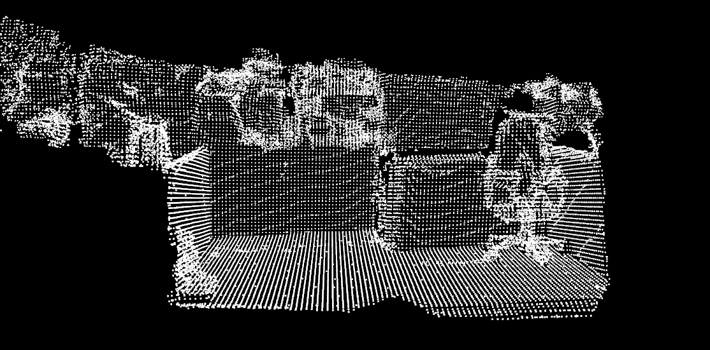
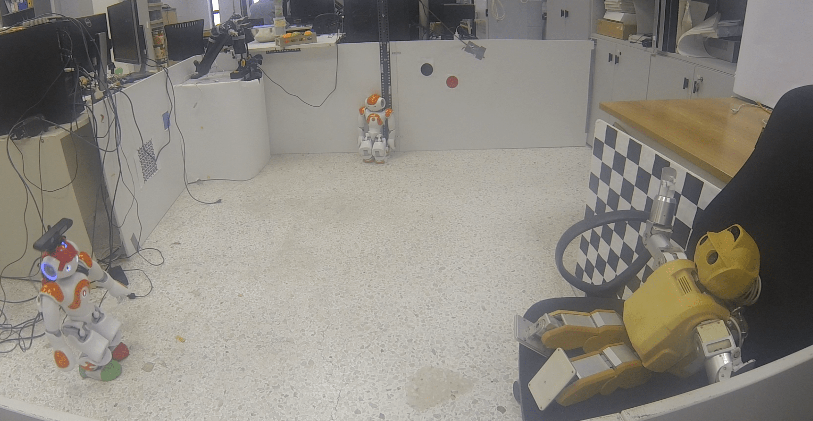

Kfusion_ros
# README
Kfusion_ros is a port of kinetic fusion to ROS. The purpose of this work is to provide a high performance gpu implementation suited for embedded devices and humanoid robots.
It has been tested on Jetson TX2 caried by a Nao robot.

Video: www.youtube.com/watch?v=mLdNwHl9cgo&feature=youtu.be

## Getting Started
## Prerequisites
* Ubuntu 16.04 and later
* ROS kinetic and later
* Eigen 3 and later
* Toon
* Cuda

## Installing
* git clone https://github.com/tavu/kfusion_ros.git
* catkin_make -DCMAKE_BUILD_TYPE=Release 

### In case Toon not found
* Opec CMakeList.txt
* comment: *find_package(TooN   REQUIRED)*
* Uncomment: *set(TOON_INCLUDE_PATHS "~/src/TooN")*
* Set proper toon path

### In case Eigen not found
* Opec CMakeList.txt
* comment: *find_package(Eigen3   REQUIRED)*
* Uncomment: *set(EIGEN3_INCLUDE_DIR "~/src/eigen")*
* Set proper Eigen3 path

## Examples
### Office map

### NAO with Nvidia JetsonTX2 module

## Reference
 * KinectFusion [Newcombe et al. ISMAR'11]: C++, OpenMP, OpenCL and CUDA inspired by https://github.com/GerhardR
 * SLAMBench2 [Bruno Bodin et al. ICRA 2018 ]: https://github.com/pamela-project/slambench2
 
 
